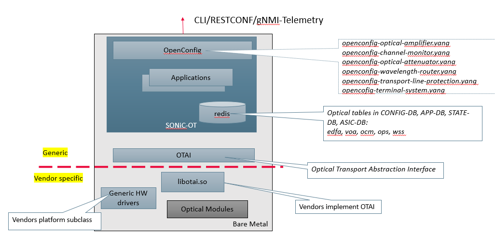
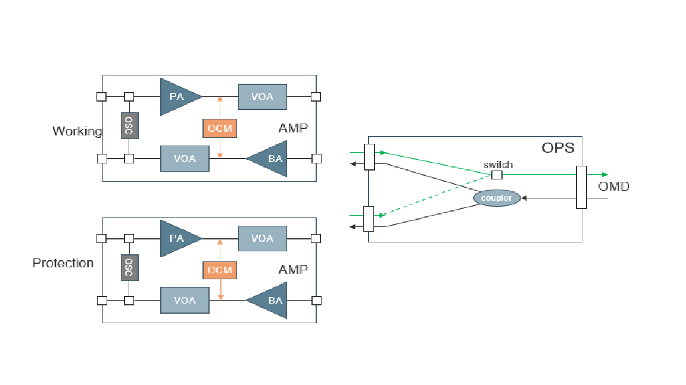
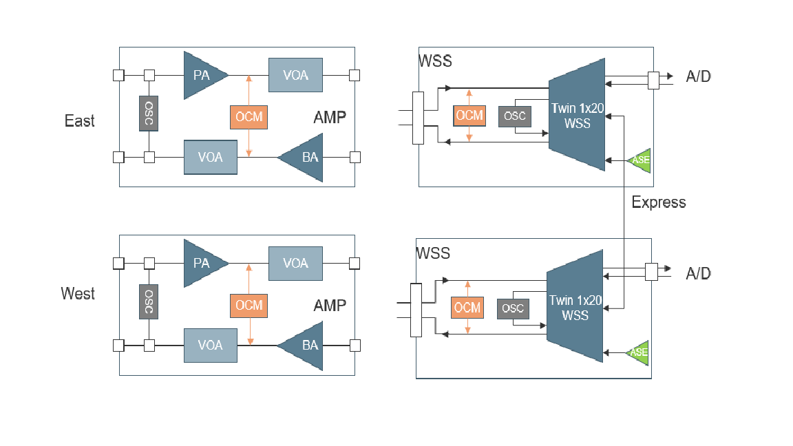
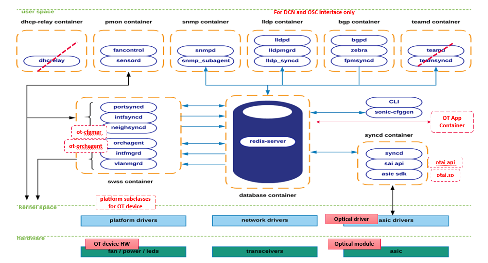

# Project Working Document

This document aims to capture information on all project activities, especially the design and the other decisions by sonic-otn-wg. It should be up-to-date always. 

## sonic-otn Project Overview
This section should be communicated to the large SONiC community for seeking feedbacks.

### Charter
sonic-otn-wg will focus on enabling SONiC to support optical transport equipment, including
* Optical transponders/muxponders.
* Optical line equipment such as optical amplifiers, wavelength selective switches.  
* Optical DWDM/Grey pluggable modules on switching/routing equipment.
* Packet-optical device (ex. [Cassini](https://telecominfraproject.com/oopt/)) with both packet and optical functionality (Stretched goal).

### Estimated Duration
Two years, by  December, 2024

### Contribution Deliverables to SONiC Community
* Optical Transport Abstraction Interface (OTAI) Specification and header files.
* Contribution to SONiC code base for support optical transport devices:
  - sonic-ot-vendorA.bin, for all devices of vendorA.
  - sonic-ot-vendorB.bin, for all devices of vendorB.
  - sonic-ot-kvm.img.gz, Virtual optical device. 
  - ONIE images for optical device families.

With above deliverables, SONiC effectively becomes a network operating system (NOS) supporting both packet switch and optical transport white box.

### Supported Optical Device Types
As there are different types of optical transport devices in optical network, some typical configurations are support as part of this project. Vendors should be able to customize their variations with minimum effort at device level under the same optical platform.
* Optical Amplifier: A terminal amplifier with protection is a target implementations. Non-protected or in-line amplifier can be customized from it. The optical diagram of termal amplifier is shown as following:

* 2D-ROADM: Single box support 2 degree ROAMD is another target implementation. High degree ROADM could be formed by multiple 2D-ROADM (disaggregated approach).

* Transponders:[TBD]

* Optical-packet device: Such as [Cassini](https://cdn.brandfolder.io/D8DI15S7/as/q3wkdg-476u4o-8wg0g7/Cassini_at_a_Glance_-_Telecom_Infra_Project.pdf)

### High Level Design
The design objective is to fully inherit existing SONiC architecture and infrastructure and seamlessly extending SONiC implementation with optical features without impacting on current switch platforms. The following diagram shows potential changes at system level. The modifications of existing SONiC are illustrated in red.

The the following repository and container level design will be provided later, as the project progressing. Some highlights including:
* For pure optical transport devices with no switching functionality, dhcp-relay and teamd container would be disabled.
* lldp and bgp container will be retained to support L2/L3 protocol on DCN and OSC interfaces of optical devices.
* For pmon container, new platform drivers (python subclasses) will be implemented by whitebox vendor to manage generic hardware, i.e., chassis, control card, line card, PSU, fan and thermal sensors. It also manages the optical module's generic aspect (manufacturing info, firmware version) as  [platform components](https://github.com/sonic-net/SONiC/blob/master/doc/platform_api/new_platform_api.md).
* [openconfig optical transport yang models](https://github.com/openconfig/public/tree/master/release/models/optical-transport) are adopted to support optical features, thus to be added to the existing SONiC NBI (REST and CLI) in sonic-management-common and sonic-management-framework.
* In swss container, new optical configure managers will be added to process config change in config-db and update the app-db. Also ochagent will be enhanced to invoke OTAI APIs to modify the asic-db.
* Enhanced Syncd container processes the updates in asic-db and invoke OTAI APIs to interacting with optical modules. Whether OTAI communicated to optical module directly or via line card software stack is hardware/vendor dependent. As long as vendor implements the OTAI as library dynamically loaded at run time.
* sonic-buildimage repository will be enhanced by adding newly supported optical platforms. These platforms are parallel to the existing switch ASIC platforms, such as broadcom, barefoot, marvell and vs. 

In addition, an optical application container will be added to host optical monitoring and control processes including channel and port level power control loop and auto gain control by reading and setting redis DBs.

## OTAI Specification
This section provides a proposed specification for optical transport abstraction interface. It will be submitted to the community for review after a consensus is reached within sonic-otn working group.

## Detail Design

Each items below should have a status of:
* TBD.
* in progress.
* completed.

### OTAI (in progress)
* LAI -> OTAI name change.
* Make generic hardware management as customized APIs. These functionalities are covered in existing pmon container.

### sonic-platform-daemon sonic-platform-common (in progress)
* Restore deleted original code of platform python base classes and pmon daemons (PSU, Fan, Thermal, xcvr).
* Change newly created platform python classes as existing platform subclasses to reduce duplicated code.
* Newly created daemon can be optionally launched at run time, based on device config (pmon_daemon_control.json).

### sonic-management-framework sonic-management-common
### sonic-swss-common sonic-olss sonic-lairedis
### sonic-utility sonic-telemetry
### sonic-buildimage ONIE