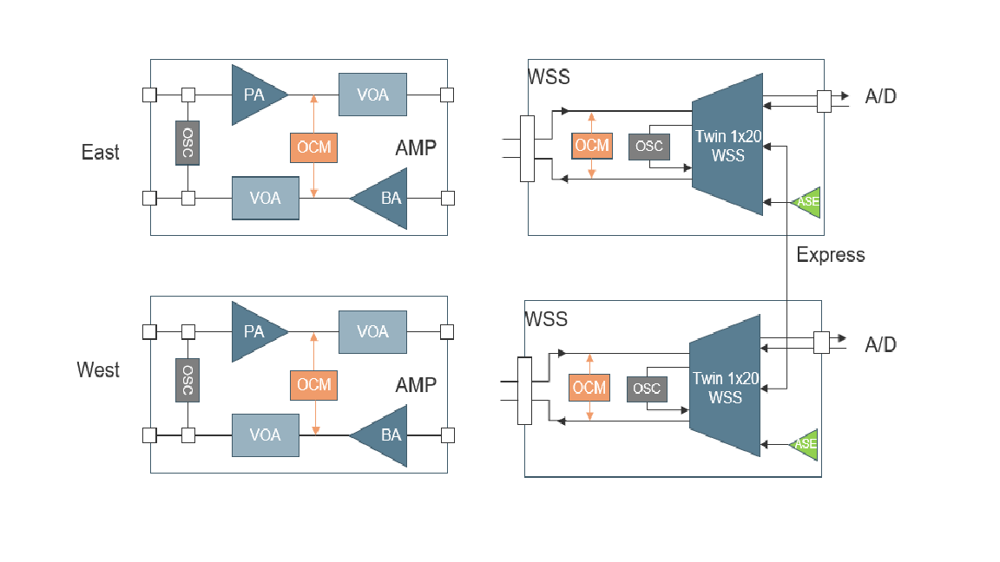

# sonic-otn High Level Design (in progress)

## Supported Optical Device Types
As there are different types of optical transport devices in optical network, some typical configurations are support as part of this project. Vendors should be able to customize their variations with minimum effort at device level under the same optical platform.
* Optical Amplifier: A terminal amplifier with protection is a target implementations. Non-protected or in-line amplifier can be customized from it. The optical diagram of terminal amplifier is shown as following:

* 2D-ROADM: Single box support 2 degree ROAMD is another target implementation. High degree ROADM could be formed by multiple 2D-ROADM (disaggregated approach).

* Transponders:[TBD]

* Optical-packet device: Such as [Cassini](https://cdn.brandfolder.io/D8DI15S7/as/q3wkdg-476u4o-8wg0g7/Cassini_at_a_Glance_-_Telecom_Infra_Project.pdf)

## Optical Features Supported

sonic-ont north bound interface adopts openconfig transport yang models. [OTAI](../documentation/OTAI-v0.0.1.md) APIs are defined for optical vendors to implement vendor specific drivers (user space or kernel). The drivers are loaded at runtime as shared libraries.

### High Level Design
The design objective is to fully inherit existing SONiC architecture and infrastructure and seamlessly extending SONiC implementation with optical features without impacting on current switch platforms. The following diagram shows potential changes at system level. The modifications of existing SONiC are illustrated in red.

The the following repository and container level design will be provided later, as the project progressing. Some highlights including:
* For pure optical transport devices with no switching functionality, dhcp-relay and teamd container would be disabled.
* lldp and bgp container will be retained to support L2/L3 protocol on DCN and OSC interfaces of optical devices.
* For pmon container, new platform drivers (python subclasses) will be implemented by whitebox vendor to manage generic hardware, i.e., chassis, control card, line card, PSU, fan and thermal sensors. It also manages the optical module's generic aspect (manufacturing info, firmware version) as  [platform components](https://github.com/sonic-net/SONiC/blob/master/doc/platform_api/new_platform_api.md).
* [openconfig optical transport yang models](https://github.com/openconfig/public/tree/master/release/models/optical-transport) are adopted to support optical features, thus to be added to the existing SONiC NBI (REST and CLI) in sonic-management-common and sonic-management-framework.
* In swss container, new optical configure managers will be added to process config change in config-DB and update the app-DB. Also ochagent will be enhanced to invoke OTAI APIs to modify the asic-DB.
* Enhanced Syncd container processes the updates in asic-db and invoke OTAI APIs to interacting with optical modules. Whether OTAI communicated to optical module directly or via line card software stack is hardware/vendor dependent. As long as vendor implements the OTAI as library dynamically loaded at run time.
* sonic-buildimage repository will be enhanced by adding newly supported optical platforms. These platforms are parallel to the existing switch ASIC platforms, such as broadcom, barefoot, marvell and vs. 

In addition, an optical application container will be added to host optical monitoring and control processes including channel and port level power control loop and auto gain control by invoking NBI REST/RESTCONF APIs.

## Design Options
The sonic-otn HLD is still under review and discussion. There are three options presented so far. Here are the brief description of these three architectural options. The optical service related modules are the focus here, as the core part of optical NOS is to manage and control optical service. Network service core modules are SAI, swss, redis DB and syncd in SONiC. Related repos are ``sonic-swss, SAI and sonic-sairedis``. On theother hand, enhancement on NBI and generic hardware management, ``sonic-mgmt-framework, sonic-mgmt-common, sonic-platform-daemon, sonic-platform-common``, are relatively straight forward and can be discussed later.

### Option 1: New OTN Containers
Current sonic-otn implementation contributed by ALI/Accelink.

In this approach, original SAI, swss and sairedis is modified to support OTN functions. As a result, three new repos ``sonic-olss, OTAI and sonic-laredis`` are created. In these repos, new business logic for OTN is added and the build/compile and runtime infrastructure is cloned from SONiC and modified.

<b>pros</b>: 
- A working system. This is one of the first SONiC based optical NOS.
- Packet switching business logic code is removed and code simplified for OTN devices.

<b>cons</b>:
- created a parallel code base of SONiC infrastructure (scripts, utilities, data types, meta, code generation, etc.). This would make maintenance(continuously sync with upstream SONiC) a big effort.
- Potential support for packet-optical device is not feasible. 

### Option 2: OTN Functions in Existing Containers
This option is proposed by Molex team based on deep dive studying of existing SONiC design and implementation, as well as extensive prototyping.

In this approach, original SAI, swss and sairedis are retained and unchanged. OTN code only contains the new APIs and optical business logic (OTAI, confmgr and orchagent). At compile time, the OTN code is plugged into SONiC code base (always latest) for OTN platforms, and OTN code is not included build for switching platforms. At runtime, the packet switching functions/features in swss, syncd will not be initialized/activated for a OTN platform. Therefore, syncd only uses OTAI APIs.

<b>pros</b>:
- Total transparent (no impact) for the existing switching platform, as the OTN code will not included in the image building.
- Since there are no duplicated code from existing SONiC code base, no on-going maintenance is needed, as upstream SONiC involving. 
- set up a good base to support potential optical-packet device.

<b>cons</b>: 
- Compile time and run time dynamic behavior support need to be well designed and implemented. Certain technical risk exists. However, initial prototyping is promising that this approach would work.

### Option 3: New OTN Containers and Existing Containers
In this approach proposed by Infinera team, two new containers (olss, ot-syncd) are added while original swss and syncd for packet switch are retained at runtime. Also a new optical-DB is introduced to store optical info (equivalent to asic-DB).

<b>pros</b>:
- Total separation of OTN (code base and runtime container) from existing switching platform. 
- As switching features are available all the time optical-packet device can be easily supported. 

<b>cons</b>: 
- New container implementation still need to copy original swss, sairedis code, unless a totally new code is developed. On-going the maintenance is needed to sync with upstream SONiC changes.
- Technical risk: The current SONiC architecture does not support two swss and syncd container. For example, there can not be two syncd listening on tables in Flexcounter DB. Also for OTN devices, we still need vendor sai implemented (maybe a dummy one). Otherwise, swss and syncd won't be running properly.