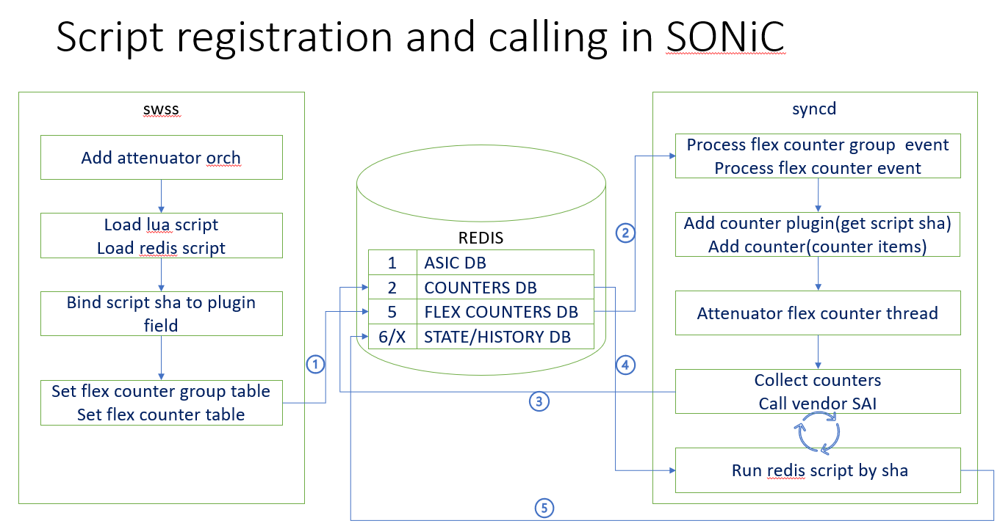
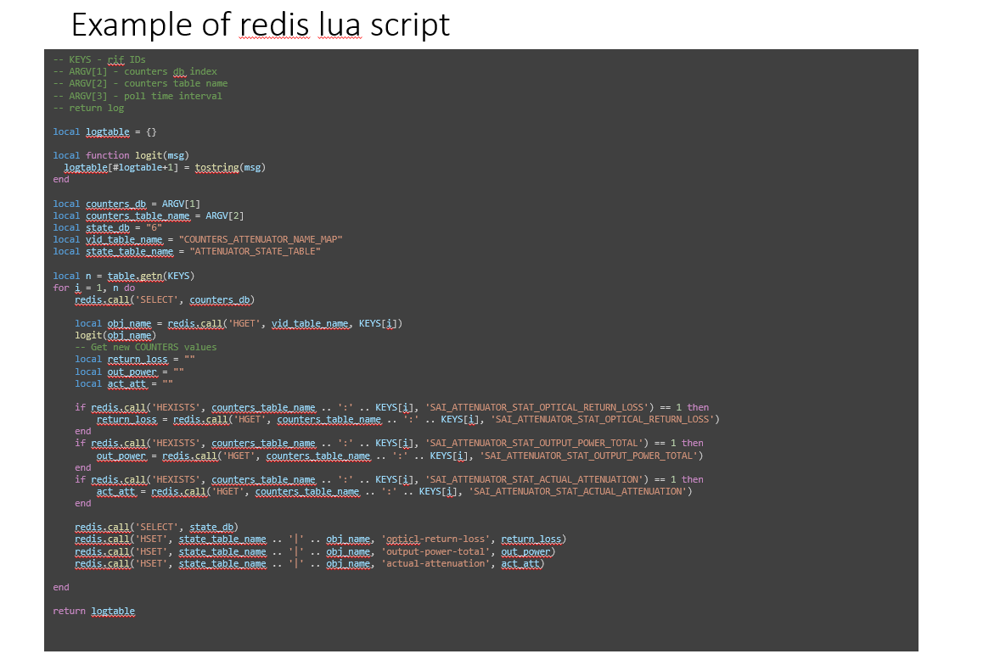

# 1. OTAI Integration to SONiC
## The Issue
[OTAI](../OTAI-v0.0.1.md) defines the APIs for optical vendors to implement SONiC drivers in optical transport devices, a great initiative. The current [implementation](https://github.com/zhengweitang-zwt/OTAI) of OTAI is derived from SAI code base. Although the OTAI APIs are new and independent from SAI, it cloned and modified SAI infrastructure and framework, such as all tool scripts and meta mechanism. This creates a parallel version of code base. As SAI keep involving, adding new features and bug fixes, OTAI would be quickly obsoleted without constantly sync with SAI which is a non-sustainable effort. (SAI has 80+ commit just in the first half of 2023)

Therefore, an alternative design is proposed for a more seamless solution of integrating OTAI into SONiC without carrying the burden of maintaining the SAI infrastructure.

## SAI experimental extension
While supporting core packet switching features, SONiC also has some build-in extension/customization mechanisms that allows developers to add new or enhance existing features.
SAI extension [Design](https://github.com/opencomputeproject/SAI/blob/master/doc/SAI-Extensions.md) goals:
- Support optional and customized SAI attributes object and SAI APIs.
- Allow innovation and experimental features before official inclusion in SAI.
- Experimental extension APIs does not impact existing SONiC systems.

 SAI extension [implementation](https://github.com/opencomputeproject/SAI/tree/master/experimental):
- Add new attributes, ex., add new attributes in saiswitchextensions.h.
- Add new API types in saiextension.h.
- Add new object types in saitypesextensions.h
- Can not modify existing SAI.

[DASH](https://github.com/sonic-net/DASH) project recently added new API and objects into SAI experimental extension to support DASH hosts, please see source code [here](https://github.com/opencomputeproject/SAI/tree/master/experimental).

```
#ifndef __SAIEXTENSIONS_H_
#define __SAIEXTENSIONS_H_

#include <sai.h>
#include <saitypes.h>

/* new experimental object type includes */
#include "saiexperimentaldashvip.h"
#include "saiexperimentaldashacl.h"
...
#include "saiexperimentalbmtor.h"

/**
 * @brief Extensions to SAI APIs
 *
 * @flags free
 */
typedef enum _sai_api_extensions_t
{
    SAI_API_EXTENSIONS_RANGE_START = SAI_API_MAX,
    SAI_API_BMTOR = SAI_API_EXTENSIONS_RANGE_START,
    SAI_API_DASH_ACL,
    ...
    SAI_API_DASH_VIP,
    /* Add new experimental APIs above this line */
    SAI_API_EXTENSIONS_RANGE_END

} sai_api_extensions_t;

#endif /* __SAIEXTENSIONS_H_ */
```

## Dynamically OTAI Extension To SAI 

As described above, DASH extended SAI by adding and modifying the SAI extension files. This approach requires:
- The APIs should be relative mature as large community may start using them;
- Pull request of SAI change needs the SAI team's approval, which may take while.

SAI experimental extension mechanism can be utilized to extend SONiC to support OTN features. However, as OTAI spec is still in its initial stage, so the DASH approach (directly change SAI) may not be efficient at this time. The design objectives of OTAI extension are listed as followings:

- Separated code base from SAI and Keep OTAI as an independent [repo](https://github.com/zhengweitang-zwt/OTAI). 
- Completely reuse and no change to existing SAI code base, including code and tools (ex., meta, parser.pl etc). 
- Based on SAI meta mechanism, OTAI extension is plugged in at compile time:
  - clearly separate OTAI and SAI code base.
  - Without any impact on the existing SONiC platform and SAI spec.
  - No change is needed for existing SAI code base

The following diagram illustrates the OTAI compile time plug in as SAI extension. 


- A git submodule OTAI [repo](https://github.com/zhengweitang-zwt/OTAI) is added into sonic-sairedis repo.
- At compile time, for any otn platform, ``otaiextension.py`` script is invoked to extract OTAI APIs and object types from ``otai.h`` and ``otaitypes.h`` and insert them into ``saiextension.h`` and ``saitypesextension.h``. otai header files are also modified to meet SAI syntax verification.
- For existing switch platform, `otaiextension.py` will not be called and this change is totally transparent to SONiC packet switching.
- Regular SAI compile then is invoked. As a result, for OTN platform, SAI meta data/code generated by ``parser.pl`` would include OAI API and object type.
  
Note that generated code in meta directory, not the original source code, is used in compile of the rest of software modules (ex.,swss and syncd):
- clear separation of SAI and OTAI code base;
- No SAI changes, header files and perl tools, are required.
- OTAI is a pure add-on at compile time and no duplicated code/tools from SAI. Therefore it is maintenance free and always updated with latest SAI.

As SAI is the center of other modules, swss, syncd and DBs (flexcounter, couter, asic). This provided a potential seamless extension of these modules to support OTN.

## Prototype
`saiextension.h` after run otn plugin script `otaiextension.sh`:

```#ifndef __SAIEXTENSIONS_H_
#define __SAIEXTENSIONS_H_

#include <saitypes.h>

/* existing enum extensions */
#include "saitypesextensions.h"
#include "saiswitchextensions.h"

/* otn experimental extension */
#include "otaiobject.h"
#include "otailinecard.h"
#include "otaiport.h"
#include "otaitransceiver.h"
#include "otailogicalchannel.h"
#include "otaiotn.h"
#include "otaiethernet.h"
#include "otaiphysicalchannel.h"
#include "otaioch.h"
#include "otailldp.h"
#include "otaiassignment.h"
#include "otaistatus.h"
#include "otaitypes.h"
#include "otaiaps.h"
#include "otaiapsport.h"
#include "otaiattenuator.h"
#include "otaiinterface.h"
#include "otaioa.h"
#include "otaiosc.h"
#include "otaiwss.h"
#include "otaimediachannel.h"
#include "otaiocm.h"
#include "otaiotdr.h"

/* new experimental object type includes */
#include "saiexperimentalbmtor.h"
/**
 * @brief Extensions to SAI APIs
 *
 * @flags free
 */
typedef enum _sai_api_extensions_t
{
    SAI_API_EXTENSIONS_RANGE_START = SAI_API_MAX,

    SAI_API_BMTOR = SAI_API_EXTENSIONS_RANGE_START,

    SAI_API_OTAI_LINECARD         , /**< otai_linecard_api_t */
    SAI_API_OTAI_PORT             , /**< otai_port_api_t */
    SAI_API_OTAI_TRANSCEIVER      , /**< otai_transceiver_api_t */
    SAI_API_OTAI_LOGICALCHANNEL   , /**< otai_logicalchannel_api_t */
    SAI_API_OTAI_OTN              , /**< otai_otn_api_t */
    SAI_API_OTAI_ETHERNET         , /**< otai_ethernet_api_t */
    SAI_API_OTAI_PHYSICALCHANNEL  , /**< otai_physicalchannel_api_t */
    SAI_API_OTAI_OCH              , /**< otai_och_api_t */
    SAI_API_OTAI_LLDP             , /**< otai_lldp_api_t */
    SAI_API_OTAI_ASSIGNMENT       , /**< otai_assignment_api_t */
    SAI_API_OTAI_INTERFACE        , /**< otai_interface_api_t */
    SAI_API_OTAI_OA               , /**< otai_oa_api_t */
    SAI_API_OTAI_OSC              , /**< otai_osc_api_t */
    SAI_API_OTAI_APS              , /**< otai_aps_api_t */
    SAI_API_OTAI_APSPORT          , /**< otai_apsport_api_t */
    SAI_API_OTAI_ATTENUATOR       , /**< otai_attenuator_api_t */
    SAI_API_OTAI_WSS              , /**< otai_wss_api_t */
    SAI_API_OTAI_MEDIACHANNEL     , /**< otai_mediachannel_api_t */
    SAI_API_OTAI_OCM              , /**< otai_ocm_api_t */
    SAI_API_OTAI_OTDR             , /**< otai_otdr_api_t */

    /* Add new experimental APIs above this line */

    SAI_API_EXTENSIONS_RANGE_END

} sai_api_extensions_t;

#endif /* __SAIEXTENSIONS_H_ */
```
# 2. OTAI Staistics Support in syncd
This section describes how to support OTN statistics without change SONiC syncd

## Issue
Current SONiC does not support traditional telecom performance management (PM) historical counters. 
- 96 buckets of 15-minute counters including min, max and average.
- 7 bucket of 24-hour counters with min, max and average.

OTN syncd added historical data by modifying the syncd code base. This causes a code base diverge from the upstream code.

## SONiC Redis plug-in scrip
SONiC counter DB is designed for storing raw data from the hardware and counters are specified in the Flex-counter DB. To meet the needs for statistics customization, SONiC provides a way of install the plug-in scripts, similar to stored procedure in traditional database systems.These scripts are running inside of redis container and can be invoked whenever the counter DB is updated. 
The following diagram shows the work flow of redis plug-in script in SONiC.



- First ochagent install the script as hashed SHA. 
- When syncd add the counter attribute, it also add the plug-in SHA.
- When vendor SAI updates the counters, it also send request to redis DB to run the script.


## Example
Here is the flex-counter DB and counter DB after script is installed for Attenuator counters:


Here is an example of plug-in script, which update the state DB:



Since the script is running inside of redis, it is very easy and efficient to read/write any DBs.

## Conclusion
Counter DB should only contains the raw data of the hardware specified in SAI. For statistics customization, redis plug-in scripts should be configured. Therefore, no syncd code need to be changed to support PM functionality for OTN devices.