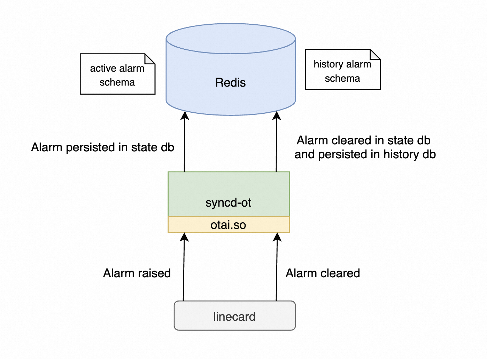

# Scope Of The Document
Information in this document is based on the SONiC-OTN software branch [`otn-legacy`](https://github.com/sonic-otn/sonic-buildimage/tree/otn_legacy), it doesn't support alarm suppression in the SONiC-OTN system.

This document provides some insights on the following.
1. The alarm requirements and definitions for northbound interfaces
2. Next section explains how to define a active and history alarm in the redis database
3. Next section explains how OTAI define the alarm notification API 
4. Last section explains how Syncd-ot save alarm information to database and syslog
   

# Requirements
An OTN alarm is a notification of an error in the network. These alarms are raised when the network device detects failures in the network, and cleared when the failures are solved.

The SONiC-OTN system can report alarms through different channels:
* Restconf
* Telemetry
* SNMP-trap
* CLI, end user can show current alarms and history alarms
* syslog


In OpenConfig, [openconfig-alarms.yang](https://github.com/openconfig/public/blob/master/release/models/system/openconfig-alarms.yang
) defines the alarm information with "id", "resource", "severity", "text", "time-created" and ""type-id"". 
Sonic-otn otn-legacy branch has already supported Restconf and telemetry alarms in openconfig-alarms.yang format.
```json
http://localhost:8080/restconf/data/openconfig-system:system/alarms
{
    "alarms": {
        "alarm": [
            {
                "id": "PORT-1-1-L1#RX_LOS",
                "state": {
                    "id": "PORT-1-1-L1#RX_LOS",
                    "resource": "PORT-1-1-L1",
                    "severity": "NOT_ALARMED",
                    "text": "#RxPwr:-66.81 dBm#RX-LOS",
                    "time-created": 1689823491562532096,
                    "type-id": "RX_LOS"
                }
            }
        ]
    }
}
```

Here is an example of show current and history alarms in CLI.
```log
[SONiC-OTN] show alarm current
ALARM CURRENT INFO :
Slot 1 CURALARM Total num:2

  id  time-created             resource     severity    type-id                       text                                    sa    type
----  -----------------------  -----------  ----------  ----------------------------  --------------------------------------  ----  --------
   1  2023-09-07 10:21:55.410  PORT-1-1-C3  MAJOR       GE_TX_RF                      GE_TX_RF                                sa    standing
   2  2023-07-20 11:24:51.562  PORT-1-1-L1  CRITICAL    RX_LOS                        #RxPwr:-66.81 dBm#RX-LOS                sa    standing


[SONiC-OTN] show alarm history
Slot 4 HISALARM Total num:2

  id  time-created             time-cleared              resource     severity    type-id           text                                          sa    type
----  -----------------------  -----------------------  -----------  ----------  ----------------  --------------------------------------------  ----  --------
   1  2023-10-18 15:44:35.286  2023-10-26 14:55:32.037  PORT-1-4-C2  CRITICAL    XCVR_MISMATCH     #Real:QSFP56-FR4 Cfg:QSFP28-LR4#XCVRMismatch  sa    standing
   2  2023-10-18 15:44:18.179  2023-10-26 14:55:32.047  PORT-1-4-C4  CRITICAL    TX_FAIL           #Tx LOS#TX-FAIL                               sa    standing
```

Here are the alarm fields description:
* id, unique ID for the alarm 
* resource, the item that is under alarm within the device
* severity, the severity level indicating the criticality and impact of the alarm, UNKNOWN, MINOR, WARNING, MAJOR, CRITICAL
* type-id, the abbreviated name of the alarm, for example, AIS, LOS, LOW, etc
* text, the string used to inform operators about the alarm
* time-created, the time at which the alarm was raised.
* time-cleared, the time at which the alarm was cleared. 
* Service Effect, Service-Affecting (SA) or Not-Service-Affecting (NSA)
* Condition Characteristics, they include standing or transient notifications.

# Database Schema
All the northbound interfaces (Restconf, Telemetry, SNMP-Trap and CLI) only interact with the redis database in SONiC-OTN. They retrieve alarm data from redis database through Restconf and CLI, subscribe database alarm tables and report alarms through Telemetry and SNMP-Trap. Here is the Alarms database schema:
```
    ;Defines current system alarms in state database
    key                 = CURALARM|alarm_id    ; alarm_id is the unique id in the system
    id                  = string ; alarm id
    time-created        = string ; Unix epoch time in nanoseconds
    resource            = string ; The item  that is under alarm
    text                = string ;The string used to inform operators about the alarm
    severity            = UNKNOWN/MINOR/WARNING/MAJOR/CRITICAL ; Alarm severity
    type-id             = string ; The abbreviated name of the alarm
    
    Example:
    127.0.0.1:5003[6]> hgetall "CURALARM|PORT-1-4-1-EDFAIN#RX_LOS"
    1) "id"
    2) "PORT-1-4-1-EDFAIN#RX_LOS"
    3) "time-created"
    4) "1689822918902996992"
    5) "resource"
    6) "PORT-1-4-1-EDFAIN"
    7) "text"
    8) "#in-los-thr:-38.0#RX-LOS"
    9) "severity"
    10) "CRITICAL"
    11) "type-id"
    12) "RX_LOS"
```

```
    ;Defines history system alarms in history database
    key                 = HISALARM#alarm_id_time-cleared    ; alarm_id is the unique id , time-cleared is the time alarm was cleared
    id                  = string ; alarm id
    time-created        = string ; Unix epoch time in nanoseconds
    resource            = string ; The item  that is under alarm
    text                = string ;The string used to inform operators about the alarm
    severity            = UNKNOWN/MINOR/WARNING/MAJOR/CRITICAL ; Alarm severity
    type-id             = string ; The abbreviated name of the alarm
    time-cleared        = string ; Unix epoch time in nanoseconds
    
    Example:
    127.0.0.1:5003[10]> hgetall "HISALARM:PORT-1-4-C4#XCVR_MISMATCH_1697615075082480896"
    1) "id"
    2) "PORT-1-4-C4#XCVR_MISMATCH"
    3) "time-created"
    4) "1697615075082480896"
    5) "resource"
    6) "PORT-1-4-C4"
    7) "text"
    8) "#Real:QSFP56-FR4 Cfg:QSFP28-LR4#XCVRMismatch"
    9) "severity"
    10) "CRITICAL"
    11) "type-id"
    12) "XCVR_MISMATCH"
    13) "time-cleared"
    14) "1698303332053624576"
```

As you can see, the alarm redis database schema includes all the Openconfig defined alarm fields. The "Service Effect" and "Condition Characteristics" are required in CLI but not contained in the database. Each device vendor can define a customized alarm profile in CLI, and refer to this customized profile based on the alarm type-id.

# OTAI alarm definition
OTAI not only defined the unified optical components attributes, but also standardize the OTN alarm `type-id`` definitions between different vendor's whitebox OTN devices. Then the Optcial SDN controller can easily manage the OTN whitebox device alarms in an open and disaggregated network.

Vendor OTAI library receives the alarm generated and cleared message from the optical linecard. Syncd-ot container will save active alarm in the state database when OTAI reports a new alarm. Syncd-ot moves an alarm from state database to the history database when the alarm was cleared.


OTAI defines an unified alarm notification API callback `lai_linecard_alarm_notification_fn`, so Syncd-ot can handle different optical alarm in the same way. This callback function is triggered when OTAI library received an alarm message from the linecard. 

`lai_linecard_alarm_notification_fn` API unified the alarm structure with Openconfig alarm definition, and OTAI unified all the alarm `type-id` in `_lai_alarm_type_t`, so different vendors can report the same alarm type-id if the same failure raised in the system.

```C++
/**
* @brief Linecard alarm notification
*
* @param[in] linecard_id Linecard Id
* @param[in] alarm_type Alarm type
* @param[in] alarm_info Alarm info
*/
typedef void (*lai_linecard_alarm_notification_fn)(
_In_ lai_object_id_t linecard_id,
_In_ lai_alarm_type_t alarm_type,
_In_ lai_alarm_info_t alarm_info);

typedef enum _lai_alarm_type_t
{
......
LAI_ALARM_TYPE_OTN_ODU_AIS,
LAI_ALARM_TYPE_OTN_ODU_LCK,
LAI_ALARM_TYPE_OTN_ODU_OCI,
LAI_ALARM_TYPE_OTN_ODU_SD,
......
LAI_ALARM_TYPE_MAX,
} lai_alarm_type_t;

/**
/**
* @brief Structure for alarm info
*/
typedef struct _lai_alarm_info_t
{
/**
* @brief Status
*/
lai_alarm_status_t status;

/**
* @brief Time created
*/
uint64_t time_created;

/**
* @brief Text
*/
lai_s8_list_t text;

/**
* @brief Resource object id
*/
lai_object_id_t resource_oid;

/**
* @brief Severity
*/
lai_alarm_severity_t severity;

} lai_alarm_info_t;
```

# Syncd-ot alarm handling
In the linecard creation process, Syncd-ot will pass the `onLinecardAlarm` function pinter to the linecard OTAI object. Once vendor's OTAI library received an alarm from the optical linecard, it can call Syncd-ot `onLinecardAlarm` function to handle the alarm.

`onLinecardAlarm` can serialize alarm types and info to string, then persist active and history alarm data in redis database, and write a syslog in the system. 

```C++
void NotificationHandler::onLinecardAlarm(
_In_ lai_object_id_t linecard_rid,
_In_ lai_alarm_type_t alarm_type,
_In_ lai_alarm_info_t alarm_info) {

j["linecard_id"] = lai_serialize_object_id(linecard_rid);
j["time-created"] = lai_serialize_number(alarm_info.time_created);
j["resource_oid"] = lai_serialize_object_id(alarm_info.resource_oid);
j["text"] = str_text = (char*)alarm_info.text.list;
j["severity"] = lai_serialize_enum_v2(alarm_info.severity, &lai_metadata_enum_lai_alarm_severity_t);
j["type-id"] = lai_serialize_enum_v2(alarm_type, &lai_metadata_enum_lai_alarm_type_t);
j["status"] = lai_serialize_enum(alarm_info.status, &lai_metadata_enum_lai_alarm_status_t);
j["id"] = str_resource + "#" + type_id;

...
}
`