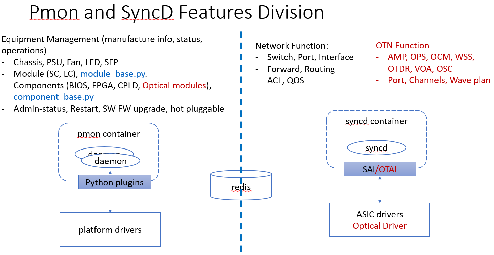
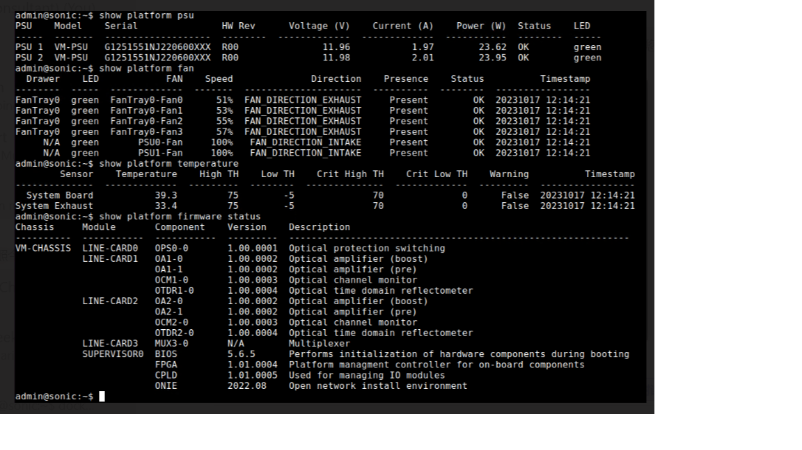
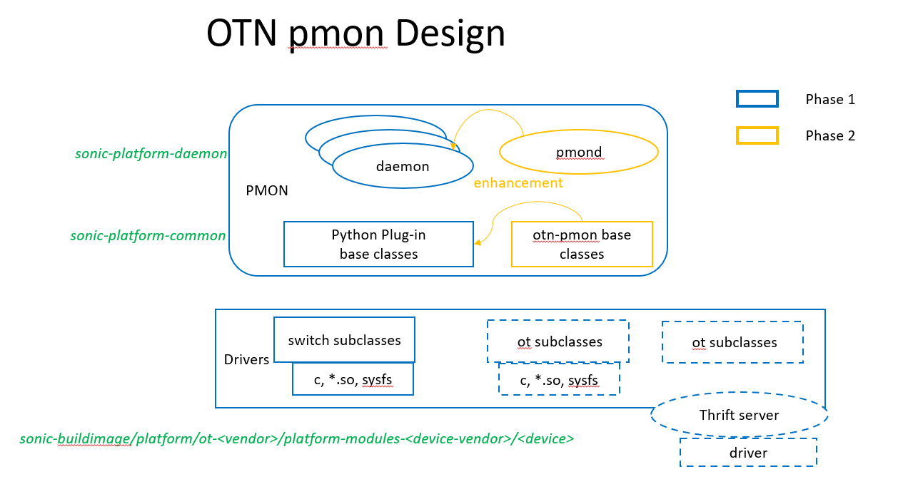

# OTN pmon Design Analysis
SONiC pmon (platform monitor) manages generic hardware, which is independent from the functionality of the device providing. pmon infrastructure is implemented in two repositories, [sonic-platform-common](https://github.com/sonic-net/sonic-platform-common) and [sonic-platform-daemon](https://github.com/sonic-net/sonic-platform-daemons) described in [here](https://github.com/sonic-net/SONiC/blob/master/doc/platform_api/new_platform_api.md). And Vendor platform module resides under ``sonic-buildimage/platfrom`` folder for each device type. 

## Functional Scope of pmon Container
pmon container manages generic hardware of network devices. The functional partition of pmon and syncd can be illustrated in the following diagram:



In SONiC, all packet switching related function are implemented in syncd container, while generic hardware management is implemented in pmon container. If the same principle is followed by OTN, pmon should not have any optical business logic. Therefore, minimum or no changes seems necessory for initial OTN version.

## Python Base Class
Python classes are implemented to model the generic hardware structure and operations on the hardware. Here is the example of a typical device structure in python classes:
- Chassis
    - System EEPROM info
    - Reboot cause
    - Environment sensors
    - Front panel/status LEDs
    - Power supply unit[0 .. p-1]
    - Fan[0 .. f-1]
    - Module[0 .. m-1] (Line card, supervisor card, etc.)
      - Environment sensors
      - Front-panel/status LEDs
      - SFP cage[0 .. s-1]
      - Components[0 .. n-1] (CPLD, FPGA, Optical modules)
        - name 
        - description
        - firmware

In OTN project, optical modules (OA, VOA, OCM, OPS, OTDR) can be modeled as components for generic monitoring and operations. We can use component+slot+number as optical component names (slot and number is 0 based ??). For example second EDFA in slot 0 is configured as:
``````
name: OA0-1 
description: variable gain EDFA
firmware: 3.0.0.1
``````
The generic operations and status supported including:
- reboot
- upgrade
- administration status and operational status

## Device Specific Modules and Drivers
In pmon container, sonic-platform-common and sonic-platform-daemon is the infrastructure and common code (python base class) for all devices. Device specific code (python sub class + drivers) resides in platform folder. For example, for a virtual OLS of ot-kvm platform, pmon drivers are located in ``sonic-buildimage/platform/ot-kvm/platform-module-ot-kvm/ols-v``

Here is an example of platform configuration for an OLS:
```json 
{
    "chassis": {
        "name": "OLSV-CHASSIS",
        "description": "KVM Virtual OLS",
        "components": [],
        "status_led": {
            "colors": [
                "off",
                "red",
                "green",
                "amber",
                "red blink",
                "green blink",
                "amber blink"
            ],
            "controllable": true
        },
        "modules": [
            {
                "name": "SUPERVISOR0",
                "description": "CONTROL-CARD",
                "components": [
                    {
                        "name": "BIOS",
                        "description": "Performs initialization of hardware components during booting"
                    },
                    {
                        "name": "FPGA",
                        "description": "Platform managment controller for on-board components"
                    },
                    {
                        "name": "CPLD",
                        "description": "Used for managing IO modules"
                    },
                    {
                        "name": "ONIE",
                        "description": "Open network install environment"
                    }
                ]
            },
            {
                "name": "LINE-CARD0",
                "description": "OPS Card",
                "components": [
                    {
                        "name": "OPS0-0",
                        "description": "Optical protection switch"
                    }
                ]
            },
            {
                "name": "LINE-CARD1",
                "description": "Working optical card",
                "components": [
                    {
                        "name": "OA1-0",
                        "description": "Optical amplifier (pre)"
                    },
                    {
                        "name": "OA1-1",
                        "description": "Optical amplifier (boost)"
                    },
                    {
                        "name": "OCM1-0",
                        "description": "Channel monitor"
                    },
                    {
                        "name": "OTDR1-0",
                        "description": "Optical time domain reflectometer"
                    }
                ]
            },
            {
                "name": "LINE-CARD2",
                "description": "Protection optical card",
                "components": [
                    {
                        "name": "OA2-0",
                        "description": "Optical amplifier (pre)"
                    },
                    {
                        "name": "OA2-1",
                        "description": "Optical amplifier (boost)"
                    },
                    {
                        "name": "OCM2-0",
                        "description": "Optical Channel monitor"
                    },
                    {
                        "name": "OTDR2-0",
                        "description": "Optical time domain reflectometer"
                    }
                ]
            },
            {
                "name": "LINE-CARD3",
                "description": "Multiplexer",
                "components": [
                    {
                        "description": "Mux DeMux Card",
                        "name": "MUX3-0"
                    }
                ]
            }
        ],
        "psus": [
            {
                "name": "PSU0",
                "status_led": {
                    "status_led": true
                }
            },
            {
                "name": "PSU1",
                "status_led": {
                    "status_led": true
                }
            }
        ],
        "fan_drawers": {
            "name": "FanTray0",
            "fans": [
                {
                    "name": "FanTray0-Fan0",
                    "speed": {
                        "controllable": true
                    },
                    "status_led": {
                        "status_led": true
                    }
                },
                {
                    "name": "FanTray0-Fan1",
                    "speed": {
                        "controllable": true
                    },
                    "status_led": {
                        "status_led": true
                    }
                },
                {
                    "name": "FanTray0-Fan2",
                    "speed": {
                        "controllable": true
                    },
                    "status_led": {
                        "status_led": true
                    }
                },
                {
                    "name": "FanTray0-Fan3",
                    "speed": {
                        "controllable": true
                    },
                    "status_led": {
                        "status_led": true
                    }
                }
            ]
        },
        "thermal_manager": false,
        "thermals": [
            {
                "name": "System Board",
                "controllable": false,
                "high-crit-threshold": false,
                "low-crit-threshold": false,
                "maximum-recorded": false,
                "minimum-recorded": false
            },
            {
                "name": "System Exhaust",
                "controllable": false,
                "high-crit-threshold": false,
                "low-crit-threshold": false,
                "maximum-recorded": false,
                "minimum-recorded": false
            }
        ]
    }
}
```

The example of show commands for optical device platform:




## OTN pmon Compatibility with Upstream
In current OTN implementation of pmon container [sonic-platform-daemon](https://github.com/sonic-otn/sonic-platform-daemons/tree/master) and [sonic-platform-common](https://github.com/sonic-otn/sonic-platform-common/tree/master), pmon python base classes and pmon daemons are rewritten.

This result a incompatible code change that can not be merged with upstream without impact existing switching platforms.

## Proposal

- Phase 1 - No changes to exiting upstream: As pmon manages generic hardware which is independent from device functions (packet or optical). We can keep it as is in initial version of OTN. This can minimize changes to existing SONiC and the scope of upstream merge. In phase 1, supporting new OTN platform/device follows existing SONiC design. Pmon vendor subclasses and drivers are added in the ``sonic-buildimage/platform`` folder. 
- Phase 2 - Enhancement: Proposal and contribute pmon enhancement which are important or desired for OTN devices. Here, we can leverage current OTN pmon implementation. Enhancements can be contributed to upstream. These changes should be beneficial for all platforms, OTN and switches.

The plan is shown in the following diagram.

