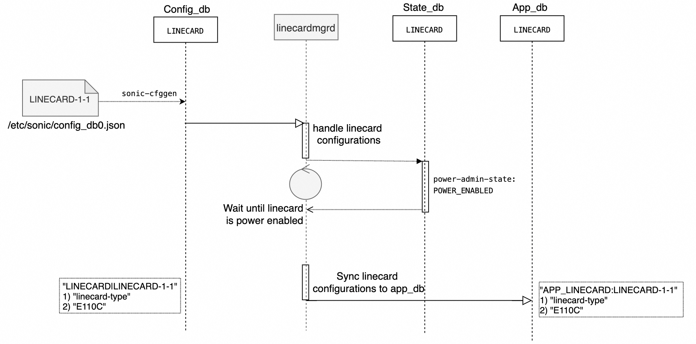
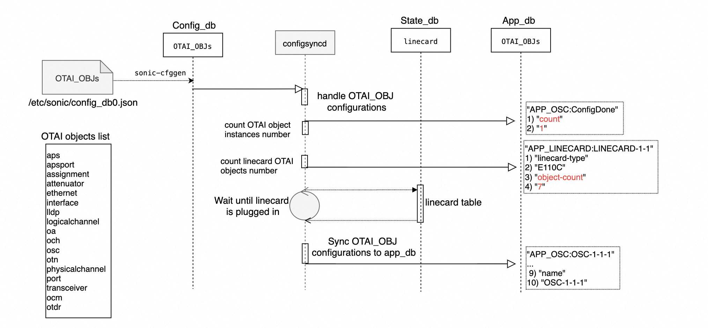

# Optical Transport State Service (OTSS) High Level Design #

## Table of Content 

### Revision  
Rev | Rev	Date	| Author	| Change Description
---------|--------------|-----------|-------------------
|v0.1 |05/03/2024  |Weitang Zheng | Initial version

### Scope  

This document describes the high level design of OTSS in SONiC

### Definitions/Abbreviations 

Definitions/Abbreviation|Description
------------------------|-----------
OTSS| Optical Transport State Service
OTAI| Optcial Transport Abstraction Interface
SWSS| Switch State Service
OTN| Optical Transport Network
CRUD| CREATE, READ, UPDATE and DELETE
OA| Optical Amplifier
OSC| Optical Supervisory Channel
OLP| Optical Line Protection
VOA|Optical Attenuator
OTDR| Optical Time Domain Reflectometer

### Overview 

OTSS is a SONiC user space docker application, which manages all the optical components and object in an OTN device with an unified and vendor-neutral OTAI APIs. It's in parallel with the SWSS and SAI in the SONiC switch.

### Requirements

The OTSS provides these functionalities:
 * Supports Multi ASIC architecture. In a SONiC-OTN product, each OTN linecard is handled as an ASIC.
 * Manages all OTAI components and objects with OTAI CRUD APIs. 
 * Configures Syncd PM and status sampling based on users configuration file.
 * Supports OTN linecard pre-configuration
 * Supports warm reboot, software upgrade OTN linecard and transceivers.
 * Supports hot plugging OTN linecard and transceivers. 

### Architecture Design 

OTSS and Syncd-OT interact with each other to manage kinds of OTN linecard and components. There are three applications and one command tool in the OTSS docker container.
* linecardmgrd  
  linecardmgrd loads OTN linecard configurations from the redis config_db to app_db, when the linecard is provisioned and plugged in the slots.
* configsyncd  
  configsyncd loads OTN linecard's OTAI objects' configurations from the redis config_db to app_db. All the OTAI objects (Transceivers, OA, OSC, OLP, VOA, etc) are handled in the same way. 
* orchagent  
  orchagent manages the OTN linecard and OTAI objects. It creates and initializes the linecard OTAI object, then the other OTAI objects within the linecard. It loads the linecard flex-counter configuration to set-up the PM and Status sampling in the Syncd-OT.  
  swss_common and otai_redis libraries are employed to access the redis database and interact with syncd-ot.
* cmd_tool
  It's an OTSS command tool to execute OTAI operations, such as reboot the linecard, trigger an OTDR scan, upgrade transceiver firmware, etc.
 

#### Linecardmgrd Design 

In an OTN device, it contains multiple pluggable optical linecards. End-user can provision different linecards, and each linecard contains different optical components. Once a linecard is inserted into a slot and powered on, linecardmgrd application loads the OTN linecard configurations from config_db to the app_db. The orchagent will handle these linecard data in app_db later.  
Here is the linecardmgrd work flow:		

Because the OTSS supports the multi-ASIC, in this flow, we illustrate the linecard in the slot 1 as an example. By default, there is no linecard data in the state_db, so the linecardmgrd keeps looping the linecard `power-admin-state` until it changes to `POWER_ENABLED`. If an linecard is insert into a slot, the PMON container will generate the linecard data in the state_db and update the `power-admin-state` to `POWER_ENABLED` if the linecard is powered on.

#### Configsyncd Design 

configsyncd application synchronizes all the other OTAI objects' configurations from the redis config_db to app_db. It counts how many kinds of OTAI objects in the linecard, and save the number in app_db linecard table, and counts how many OTAI objects instances in OTAI object's `ConfigDone` table. For example, the linecard type E110C contains 1 osc instance, and 7 kinds of OTAI objects. These counting numbers are used to check the pre-configuration process is finished or not in Orchagent application.
Here is the configsyncd work flow:		

There are more than 15 kinds of OTAI objects are defined. These objects' configurations are synchronizes by configsyncd in the same way. The synchronization process is triggered when it detect the linecard is plugged in the slot.

#### Orchagent Design 

configsyncd application synchronizes all the other OTAI objects' configurations from the redis config_db to app_db. It counts how many kinds of OTAI objects in the linecard, and save the number in app_db linecard table, and counts how many OTAI objects instances in OTAI object's `ConfigDone` table. For example, the linecard type E110C contains 1 osc instance, and 7 kinds of OTAI objects. These counting numbers are used to check the pre-configuration process is finished or not in Orchagent application.

### SAI API 

This section covers the changes made or new API added in SAI API for implementing this feature. If there is no change in SAI API for HLD feature, it should be explicitly mentioned in this section.
This section should list the SAI APIs/objects used by the design so that silicon vendors can implement the required support in their SAI. Note that the SAI requirements should be discussed with SAI community during the design phase and ensure the required SAI support is implemented along with the feature/enhancement.

### Configuration and management 
This section should have sub-sections for all types of configuration and management related design. Example sub-sections for "CLI" and "Config DB" are given below. Sub-sections related to data models (YANG, REST, gNMI, etc.,) should be added as required.
If there is breaking change which may impact existing platforms, please call out in the design and get platform vendors reviewed. 

#### Manifest (if the feature is an Application Extension)

Paste a preliminary manifest in a JSON format.

#### CLI/YANG model Enhancements 

This sub-section covers the addition/deletion/modification of CLI changes and YANG model changes needed for the feature in detail. If there is no change in CLI for HLD feature, it should be explicitly mentioned in this section. Note that the CLI changes should ensure downward compatibility with the previous/existing CLI. i.e. Users should be able to save and restore the CLI from previous release even after the new CLI is implemented. 
This should also explain the CLICK and/or KLISH related configuration/show in detail.
https://github.com/sonic-net/sonic-utilities/blob/master/doc/Command-Reference.md needs be updated with the corresponding CLI change.

#### Config DB Enhancements  

This sub-section covers the addition/deletion/modification of config DB changes needed for the feature. If there is no change in configuration for HLD feature, it should be explicitly mentioned in this section. This section should also ensure the downward compatibility for the change. 
		
### Warmboot and Fastboot Design Impact  
Mention whether this feature/enhancement has got any requirements/dependencies/impact w.r.t. warmboot and fastboot. Ensure that existing warmboot/fastboot feature is not affected due to this design and explain the same.

### Memory Consumption
This sub-section covers the memory consumption analysis for the new feature: no memory consumption is expected when the feature is disabled via compilation and no growing memory consumption while feature is disabled by configuration. 
### Restrictions/Limitations  

### Testing Requirements/Design  
Explain what kind of unit testing, system testing, regression testing, warmboot/fastboot testing, etc.,
Ensure that the existing warmboot/fastboot requirements are met. For example, if the current warmboot feature expects maximum of 1 second or zero second data disruption, the same should be met even after the new feature/enhancement is implemented. Explain the same here.
Example sub-sections for unit test cases and system test cases are given below. 

#### Unit Test cases  

#### System Test cases

### Open/Action items - if any 

	
NOTE: All the sections and sub-sections given above are mandatory in the design document. Users can add additional sections/sub-sections if required.
